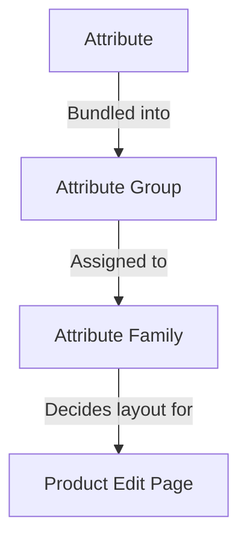

# Attributes

An **attribute** is a single characteristic of a product — *Color*, *Size*, *Brand*, *Price*, *SKU*, *Description*, *Stock*. The full set of attributes assigned to a product is what gives that product its shape: which fields appear on its edit page, which values the storefront can display, which rules validate the data.

UnoPim's attribute system has three building blocks that fit together:

Assigning a product to a family picks its editable fields; groups control how those fields are laid out on the page; attributes carry the actual values.

Assigning a product to a family picks its editable fields; groups control how those fields are laid out on the page; attributes carry the actual values.

## What's in this section

| Page | What it covers |
|---|---|
| **[Attribute Input Type](./attribute-input.md)** | The 12 data types an attribute can carry (Text, Textarea, Boolean, Select, Multiselect, Datetime, Date, Image, Gallery, File, Checkbox, Price) plus the **Swatch Types** (Color / Image / Text) introduced in v2.0. |
| **[Product Attribute](./product-attribute.md)** | How to create an attribute end-to-end — general fields, label translations, validations, configuration (Value Per Locale / Value Per Channel / Is Filterable), plus the 12 data-type inputs shown in action. |
| **[Attribute Family](./attribute-family.md)** | How to create a family and drag attributes into its groups so products in that family show the right fields. |
| **[Attribute Groups](./attribute-groups.md)** | How to bundle attributes into a group so they render together in a dedicated card on the product edit page. |

## Key concepts at a glance

- **Every attribute has a data type** — see [Attribute Input Type](./attribute-input.md). The data type determines the input control and the allowed values.
- **Every attribute belongs to a group** — groups are purely organisational, but they drive the layout of the product edit page. See [Attribute Groups](./attribute-groups.md).
- **Every product belongs to a family** — the family decides which groups (and therefore which attributes) appear on that product. See [Attribute Family](./attribute-family.md).
- **Attributes can vary by locale, by channel, or both.** Configure this under the Configuration card when creating an attribute. This is how you store a separate Description per language, or a separate Price per storefront.
- **Attributes marked `Is Filterable`** show up in the **Apply Filters** drawer on the Products listing, so your team can filter products by that attribute's values.

## v2.0 highlights

- **Swatch Types** — Select and Multiselect attributes can render as visual swatches (Color, Image, or Text) instead of plain dropdowns.
- **Video Support** in the Gallery attribute — upload and manage video files alongside images.
- **Per-attribute filtering** — toggle **Is Filterable** on an attribute and it appears in the Products listing's **Add Filter** drawer immediately, no reindex needed.

Jump to a sub-page above to see the step-by-step guide for each.
